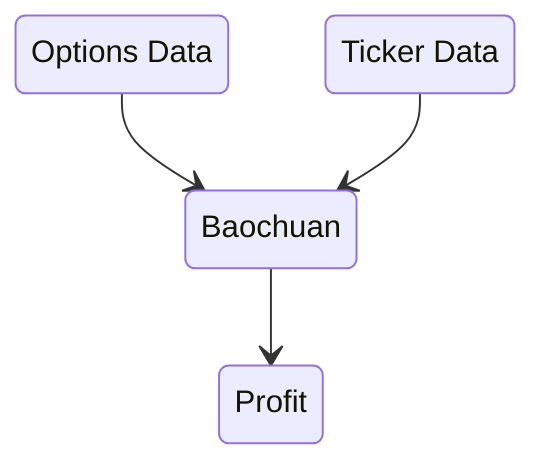

# Baochuan 寶船

Collection of indicators. Runs as a web service.

## Architecture

## Setup

### MariaDB

1. [Install MariaDB](https://mariadb.com/kb/en/installing-mariadb-on-macos-using-homebrew/)
2. Start MariaDB with `mysql.server start`
3. Import schema

## TODO

* Consider using [Jackson](https://ktor.io/docs/jackson.html#register_jackson_converter)